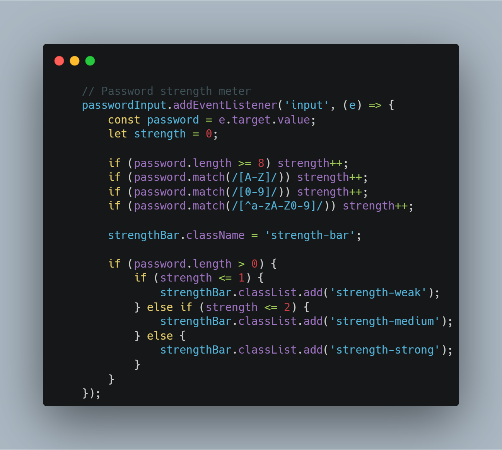
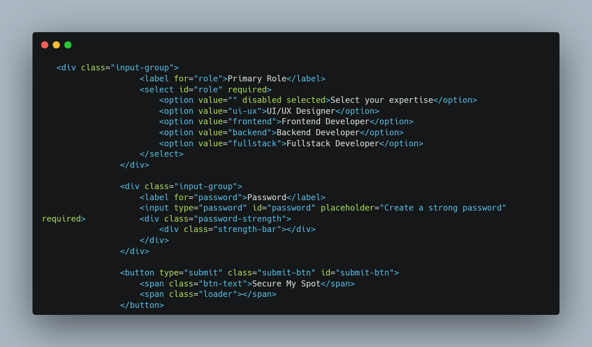

# Lumina Hackathon Sign-up Form

Welcome to the **Lumina Hackathon Sign-up Form** project! This repository contains the code for a premium, modern, and interactive registration interface designed for next-generation tech events.

## 🚀 Live Demo
**[Click here to view the live website](https://abhijeetsinghdevgan.github.io/lumina-hackathon-signup/)**

## ✨ Features
- **Glassmorphism UI:** Stunning frosted glass effects over a dark-mode background.
- **Dynamic Backgrounds:** Floating neon shapes built with pure CSS animations to keep the interface feeling "alive."
- **Interactive Feedback:** Custom-built password strength meter that updates in real-time.
- **Seamless State Transitions:** Smoothly reveals a success screen simulating an API call post-submission.
- **Fully Responsive:** Perfectly adapts to mobile, tablet, and desktop viewports.

## 💻 Tech Stack
- **HTML5:** Semantic and accessible structure.
- **CSS3:** Custom properties, flexbox, and complex keyframe animations.
- **Vanilla JavaScript:** DOM manipulation, form validation, and interactive logic.

## 🛠️ Usage
1. Clone the repository: `git clone https://github.com/abhijeetsinghdevgan/lumina-hackathon-signup.git`
2. Open `index.html` in your favorite web browser.
3. No build tools or package managers required!

## 📸 Code Previews

Check out these beautiful code snippets showcasing the core logic and structure:

### Password Strength Meter (JavaScript)

### Form Structure (HTML)

---
Designed and developed with 💜. 
